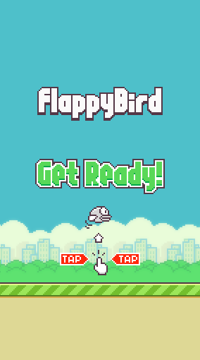
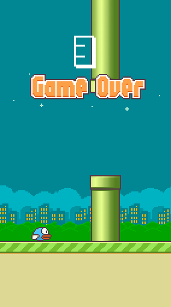

# Flappy Bird

Flappy Bird Clone is a clone of the mobile game, created to learn game development.

## Tecnologias

Esse projeto foi desenvolvido com as seguintes tecnologias:

- [Godot Engine](https://godotengine.org/)

## Screenshot

  
  

## Features

- [x] Avoid obstacles (collision)
- [x] Animation on walk/idle
- [] Attack with animation
- [] Player & monster stats
- [] Monsters tries to reach the player
- [] Monsters attacks
- [x] Player dies
- [] UI bars
- [] Monsters wander around when player's near
- [ ] A-Star algorithm when monsters trying to reach the player
- [] A cool map
- [] Animation on attack
- [] Stats bars on monsters
- [] Ranged monsters and weapons
